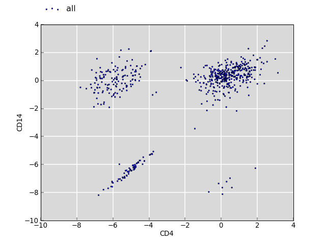

========================
Interpreting GAT results
========================

Fold change
===========

Gat reports fold changes. Fold change is simply expressed as a ratio
of an observed metric compared to the expected value of the metric
based on randomizations.

Fold changes of a single set of :term:`segments of interest` against various 
annotations can be compared directly. Indeed, the primary objective of
randomization is to remove the differences between number and segment
sizes of different annotations in order to make them comparable. For
example, the fold change of a set of transcription factor sites in
promotors can directly be contrasted with the fold change of the same
sites in introns.

When comparing the fold enrichment of multiple sets of :term:`segments of
interest` against the same annotation, some caution must be
exercised. Here, the question is to compare the fold change of
sites of transcription factor A in promotors with the fold change of
sites of transcription factor B in promotors.

The difference becomes apparent when there is no observed overlap
between the :term:`segments of interest` and the :term:`annotations`
to be compared. In order to avoid division by 0, gat adds a
pseudocount of 1 to observed and expected values: 
``fc = (observed + 1) / (expected + 1)``. With no observed overlap,
this becomes ``fc = (1 / expected + 1 )``. The amount of expected
overlap correlates with the number and size of segments in the 
:term:`segments of interest`. If there are more sites for A than for
B, the expectation of overlap is larger for A than for B. Thus, 
even if there is no overlap in both cases, the fold change values 
reported will be different. In the case of multiple annotations of
different sizes, the annotations with no overlap for both A and B
will lie along a straight line. 

There is no such bias if there is overlap between the :term:`segments
of interest` and the :term:`annotations`. As both the observed and the 
expected overlap depend upon the segment size and number of segments
of the :term:`segments of interest`, the effect cancels itself out.

The plot below shows the log2 fold change values for the same :term:`annotations`
between two sets of :term:`segments of interest` (CD4 and CD14).

   
The clouds on the upper left and lower right correspond to annotations
which have no overlap with CD4 but with CD14, and vice versa. The
cloud around the origin of the plot shows fold changes where both
overlap for CD4 and CD14 is observed. There is no bias.

The bias can be corrected by applying a constant factor that reflects
the difference in the segment sizes between the two :term:`segments of interest`.

Note that the pseudo-count method works well when comparing fold
depletion within a single set :term:`segments of interest`. Here,
the intuition is that no overlap with a larger set of annotations
should give higher fold depletion than if there is no overlap with a
small set of annotations.

It is possible to swap the :term:`segments of interest` with the :term:`annotations`.
However, there is a down-side.
The time consuming step in gat is the randomization of the 
:term:`segments of interest`. Thus it is benefical to test few
:term:`segments of interest` against many :term:`annotations`. When
swopped, each set in the :term:`annotations` will be randomized
separately and compared to a single set of :term:`segments of
interest`.

Note that :term:`P-value`s are prone to `misinterpretation`_.
In particular, the :term:`P-value` only indicates if an observed overlap is
statistically significant different from the expectation. The :term:`P-value` 
makes no inferences about the size of the effect and if it is
biologically consequential. In particular, with increasing sample
size, the expectation can be measured with higher accuracy 
leading to smaller differences to be detectable. 

Effect size
===========

The `effect size`_ is a measure of the strength of a phenomenom. In
the context of gat a useful measure of the effect size makes use of
the number of segments explained by an overlap between the 
:term:`segments of interest` and a particular :term:`annotation`.

For example, an association between transcription factor binding
sites and a particular annotation is likely to be more believable if
it explains 20% of all transcription factor binding sites, compared
to one which explains only 1% of all transcription factor binding sites.
Similarly, an association that accounts for 80% of all annotations is
likely to more effectual than one that accounts for only 1% of annotations.

Difference between fold changes
===============================

Gat computes assigns a statistical signficance to a fold change. The
:term:`P-value`, adjusted for multiple testing, reports the chance of observing
the same or more extreme fold change given a neutral model. When using
multiple :term:`annotations`, it is thus meaningful to report the
:term:`annotations` for which statistically significant enrichment was
found.

However, the :term:`P-value` does not permit to make any inferences about the
difference between two fold changes. For example, we might find that
a transcription factor is 2-fold statistically enriched in promotors
and 3-fold in UTRs, but we can not say with statistical confidence that the
enrichment in UTRs is larger than in promotors. 

Similarly, we might find that transcription factor A is 2-fold
statistically enriched in promotors and transcription factor B is
3-fold enriched in promotors. Again, we can not say with statistical
confidence that there is a difference in promotor binding between the
two transcription factors.

The latter case, in which we have two different 
:term:`regions of interest` and we want to contrast their fold
enrichment against the same annotations is implemented in gat using
the ``gat-compare.py`` command.

The ``gat-compare.py`` command takes the observed and simulated counts
from one or more ``gat-run.py`` runs. For each sample, it computes a fold
change ratio as rfc = fc1 / fc2 providing a distribution of expected
fold change ratios. The tool checks if the null hypothesis of no fold
change difference (rfc = 1) can be rejected.

.. _effect size: http://en.wikipedia.org/wiki/Effect_size
.. _misinterpretation: http://en.wikipedia.org/wiki/P-value#Misunderstandings
 
