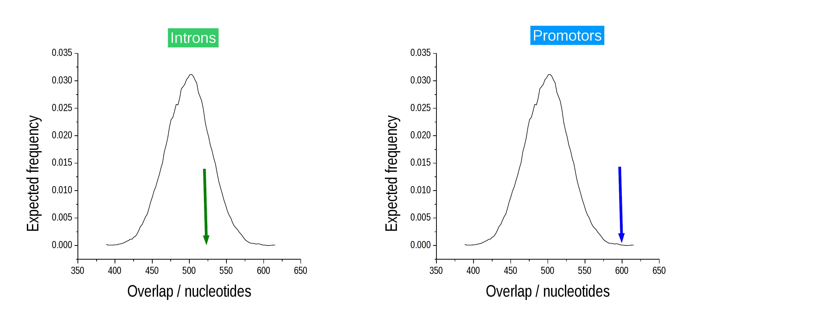
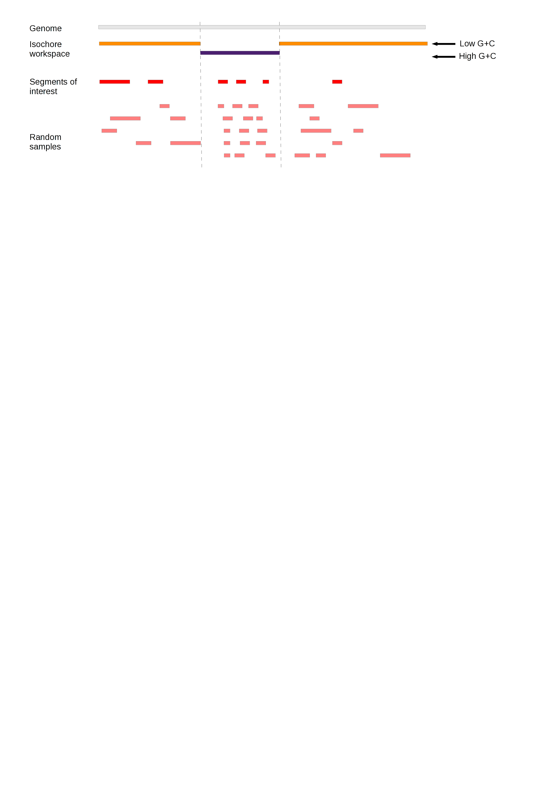

.. _Introduction:

============
Introduction
============

A common question in genomic analysis is whether two sets of genomic
intervals overlap significantly. This question arises, for example, in
the interpretation of ChIP-Seq or RNA-Seq data. 

The Genomic Association Tester (GAT) is a tool for computing
the significance of overlap between multiple sets of genomic
intervals. GAT estimates significance based on simulation. 

This introduction covers the `Method basics`_ and describes the
`Sampling method`_. It introduces the concept of the `Effective
Genome`_ and explains how to account for `G+C bias`_

Method basics
=============

Gat implemements a sampling algorithm. Given a chromosome
(:term:`workspace`) and :term:`segments of interest`, for example from a ChIP-Seq experiment, gat creates
randomized version of the segments of interest falling into the
:term:`workspace`. These :term:`sampled segments` are then compared to existing genomic
:term:`annotations`. 

The example below introduces the three sets of genomic intervals. The
:term:`workspace`, in this case a single chromosome, is grey. The :term:`segments of interest`
and :term:`sampled segments` derived from it are red and light red,
(:term:`workspace`) and :term:`segments of interest`, respectively. 
In this analysis, the :term:`annotations` are the location 
of introns (green) and promotors (blue) and we use gat to test if
the intervals in the ChIP-Seq experiment are enriched in promotors
and/or introns.

In the example above, five sets of :term:`sampled segments` have been created. Usually,
the number of samples would be much larger (>1000).

Based on the :term:`sampled segments`, the observed overlap is contrasted with
the expected overlap and an empirical p-value is determined. The
:term:`sampled segments` provide an expectation of the overlap between
the segments of interest with a particular annotation. The
distribution of the overlap is computed and the empirical p-value is
defined as the number of samples that show an equal or greater overlap
than the observed overlap.

In the previous example, the overlap with promotors is significant (right), while the overlap
with introns (left) is not significantly different from the
expectation. We would thus conclude, that our ChIP-Seq intervals are
significantly enriched in promotors, but not enriched in introns.
Testing for depletion works similarly.

Sampling method
===================
   
The sampling method is conceptually simple. Randomized samples of the
segments of interest are created in a two-step procedure.

Firstly, a segment size is selected from to same size distribution as the original segments of
interest. Secondly, a random position is assigned to the segment. The
sampling stops when exactly the same number of nucleotides have been
sampled. 

To improve the speed of sampling, segment overlap is not
resolved until the very end of the sampling procedure. Conflicts are
then resolved by randomly removing and re-sampling segments until a
covering set has been achieved.  

Because the size of randomized segments is derived from the observed segment size
distribution of the segments of interest, the actual segment sizes in
the :term:`sampled segments` are usually not exactly identical to the ones in the
:term:`segments of interest`. This is in contrast to a sampling method that
permutes segment positions within the workspace.

Effective genome
====================

Not all regions of the genome are equally accessible to the segments
of interest. For example, reads from a ChIP-Seq experiment will never
be mapped to a region that is an assembly gap. Failing to account
for inaccessible regions causes inflated estimates of fold change and
statistical significance.

To illustrate this, assume that a particular set of :term:`segments of interest` can
only be present on chrX. If we included all chromosomes in the :term:`workspace`,
any overlap between the :term:`segments of interest` and any :term:`annotations` on
chrX would be overestimated as the :term:`sampled segments` are spread over both chrX and 
the autosomes. 

Such a chromosomal bias is strong and obvious. Often the bias is much more distributed.
For example, when comparing orthologous positions between two genomes in a comparative
analysis, it is important that the workspace is restricted to only those regions
where there is genomic alignment, as orthologous positions will not be found outside of regions
that can be aligned.

In order to account for the effective genome, GAT limits the accessible space for simulated segments to a
:term:`workspace`, which can be restricted to exclude all regions not appropriate for the analysis. Randomly
sampled segments will not fall outside the :term:`workspace`:

What regions need to be excluded from the analysis depends very much
on the test being performed. Commonly excluded are for example
assembly gaps and regions of low mapability for NGS experiments.

The definition of a :term:`workspace` is crucial and often several :term:`workspace`
restrictions need to be combined. For example, in
order to test if human long non-coding RNA that are shared with
mouse overlap with certain chromatin marks, the workspace should be
restricted to only those genomic regions in human that align in mouse
and also be limited to regions of high mapability. 

G+C bias
=========

The human genome (together with many others) is not uniform. Best
known is its division into regions of low and high G+C content
(:term:`isochores`). Other genomic properties correlate with these, such as
gene density, substitution rates, etc. Plus, next-generation
sequencing methods display their own G+C biases.

GAT can control for these biases by splitting the genomic region
accessible for simulated segments (:term:`workspace`) into smaller regions
(:term:`isochores`). Segments are sampled on a per-isochore basis, thus
preserving any confounding effects due to different G+C content,
before the overall enrichment is computed by combining results from
all isochores.

In the example above, G+C content correlates with the density of
segments of interest. Regions of low G+C (orange) contain fewer segments than regions
of high G+C (purple). Sampling within separate isochores preserves the
difference in density.

The :term:`workspace` can be divided into an arbitrary amount of different
:term:`isochores`. This is a general technique that can be used to control for
different types of bias.
