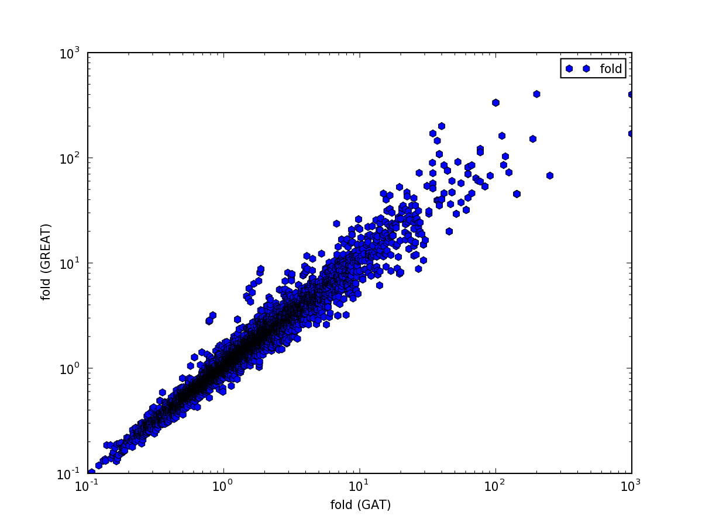
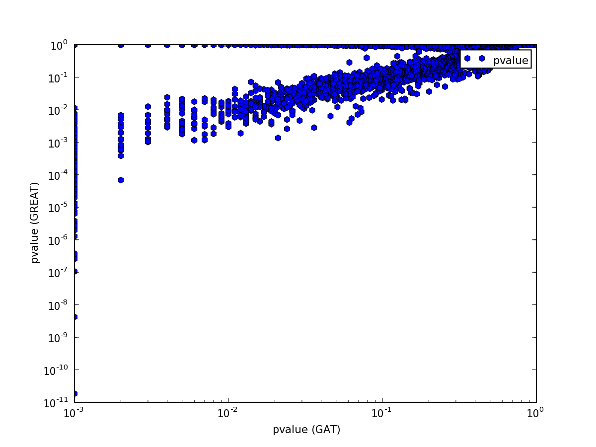
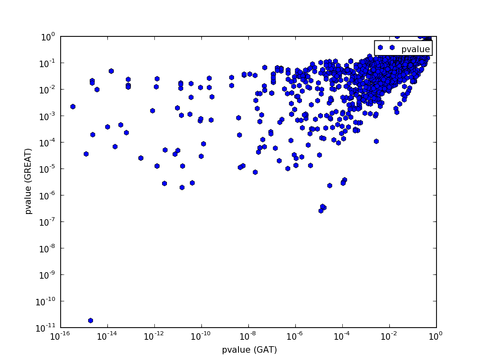

==================================
Tutorial - Functional annnotation
==================================

This tutorial demonstrates the use of *gat* for functional annotation.
The tutorial follows the analysis in the `MacLean et al. (2010)`_
paper introducing `GREAT`_.

We are interested if the binding sites of SRF predicted from
our ChIP-Seq experiment are enriched in the regulatory domains
of genes of specific functions. 

The data is in :file:`srf.hg19.bed`. This :term:`bed` formatted file
contains 556 high confidence peaks from the analysis of `Valouev et al. (2008)`_
mapped to human chromosome hg19.

Functional annotation with GREAT
=================================

*gat* comes with a tool called :file:`gat-great` that computes
enrichment statistics using the binomial test implemented in `GREAT`_.

To do an analysis as implemented in `GREAT`_, we have prepared a 
:term:`bed` formatted file (:file:`regulatory_domains.bed`)
with regulatory domains using GREAT's basal+extension rule.

In GREAT's definition, the regulatory domain of a gene contains a basal
region and an optional extension. The basal region is defined as 
the region 5kb upstream and 1kb downstream of the transcription 
start site of a representative transcript. The basal region
is then extended up to 1Mb in either direction but only up to
the basal region of the closest domains.

In this example, we have used the transcription start sites
of the ENSEMBL human protein coding gene set of `Ensembl`_ (release
67). 

Each gene was replaced with GO terms associated with the
gene obtained from the `GO Gene Ontology`_ definitions. GO terms were mapped via
uniprot identifiers to genes and ancestral ontology terms were
inferred.

GREAT excludes assembly gaps in the genome from the analysis. The :term:`bed`
formatted :file:`contigs_ungapped.bed` contains all genomic regions
exclusive of assembyl gaps.

We have now all data in place to run a GREAT_ analysis::

   gat-great.py --verbose=5 \
                --log=great.log \
                --segments=srf.hg19.bed \
   		--annotations=regulatory_domains.bed \
		--workspace=contigs_ungapped.bed \
		--ignore-segment-tracks \
		--qvalue-method=BH \
		--descriptions=go2description.tsv \
   >& great.tsv

We also added a file :file:`go2description.tsv` that contains a table with
descriptions for `GO`_ identifiers.

We inserted the table into an SQL database for easy analysis.
These are the top 10 results:

+----------+-----------------+--------+---------------+----------------------------------------------------------------------------+
|annotation|pvalue           |observed|expected       |description                                                                 |
+----------+-----------------+--------+---------------+----------------------------------------------------------------------------+
|GO:0015629|1.84357379006e-11|52      |18.0074449104  |"actin cytoskeleton"                                                        |
+----------+-----------------+--------+---------------+----------------------------------------------------------------------------+
|GO:0032796|4.22734641877e-09|5       |0.0557976925372|"uropod organization"                                                       |
+----------+-----------------+--------+---------------+----------------------------------------------------------------------------+
|GO:0070688|1.05832288791e-07|7       |0.358045266782 |"MLL5-L complex"                                                            |
+----------+-----------------+--------+---------------+----------------------------------------------------------------------------+
|GO:0043229|2.56771180099e-07|424     |369.125027893  |"intracellular organelle"                                                   |
+----------+-----------------+--------+---------------+----------------------------------------------------------------------------+
|GO:0044424|3.38999777659e-07|457     |406.64284565   |"intracellular part"                                                        |
+----------+-----------------+--------+---------------+----------------------------------------------------------------------------+
|GO:0043226|3.77332356747e-07|424     |369.977837368  |organelle                                                                   |
+----------+-----------------+--------+---------------+----------------------------------------------------------------------------+
|GO:0072303|1.28008163954e-06|3       |0.0198635059219|"positive regulation of glomerular metanephric mesangial cell proliferation"|
+----------+-----------------+--------+---------------+----------------------------------------------------------------------------+
|GO:0001725|1.96123184157e-06|12      |2.08962341062  |"stress fiber"                                                              |
+----------+-----------------+--------+---------------+----------------------------------------------------------------------------+
|GO:0005634|2.30813240931e-06|295     |240.687702571  |nucleus                                                                     |
+----------+-----------------+--------+---------------+----------------------------------------------------------------------------+
|GO:0045214|2.78146278125e-06|11      |1.79113154372  |"sarcomere organization"                                                    |
+----------+-----------------+--------+---------------+----------------------------------------------------------------------------+

.. .. note::

..    The table was created with the following statement::

..       s3 csvdb "select annotation, pvalue, observed, expected, description FROM great where qvalue < 0.05 order by pvalue limit 10"

Validation against GREAT
------------------------

We can check if the results are comparable to the GREAT_
server. We submitted our segments to GREAT_, downloaded all the results
into :file:`srf.great.all.tsv` and loaded them into an SQL
database. These are the top 10 results:

+----------+------------+----------+----------+-------------------------+
|ID        |BinomP      |ObsRegions|ExpRegions|Desc                     |
+----------+------------+----------+----------+-------------------------+
|GO:0015629|3.064707e-11|51        |17.68622  |"actin cytoskeleton"     |
+----------+------------+----------+----------+-------------------------+
|GO:0032796|4.223825e-09|5         |0.05578831|"uropod organization"    |
+----------+------------+----------+----------+-------------------------+
|GO:0045214|1.057722e-08|10        |0.7800466 |"sarcomere organization" |
+----------+------------+----------+----------+-------------------------+
|GO:0030863|2.205659e-08|16        |2.666392  |"cortical cytoskeleton"  |
+----------+------------+----------+----------+-------------------------+
|GO:0001725|1.786459e-07|13        |1.991518  |"stress fiber"           |
+----------+------------+----------+----------+-------------------------+
|GO:0044424|2.007378e-07|479       |431.1647  |"intracellular part"     |
+----------+------------+----------+----------+-------------------------+
|GO:0070688|2.151319e-07|7         |0.3981916 |"MLL5-L complex"         |
+----------+------------+----------+----------+-------------------------+
|GO:0005634|2.556219e-07|311       |251.391   |nucleus                  |
+----------+------------+----------+----------+-------------------------+
|GO:0032432|2.931657e-07|13        |2.081847  |"actin filament bundle"  |
+----------+------------+----------+----------+-------------------------+
|GO:0043229|3.557439e-07|443       |390.9065  |"intracellular organelle"|
+----------+------------+----------+----------+-------------------------+

.. .. note::

..    We used the following statement to create the table::
    
..        s3 csvdb "select ID, BinomP, ObsRegions, ExpRegions, Desc  FROM greatserver where BinomFDRQ < 0.05 order by BinomP limit 10"

The top 10 results are comparable. The same holds generally
for fold change values:

and pvalues:

Some differences are to be expected:

1. We use the ENSEMBL gene set, while GREAT uses Refseq_. 
2. We use a different definition of representative transcripts.
3. Our coordinates of alignment gaps might differ.
4. The assignment of GO terms to genes differ.
5. The implementations might differ in some details.

Functional annotation with gat
==============================

Gat can be run with the same input as we used for great::

    gat-run.py --verbose=5 \
	       --log=gatnormed.tsv.log \
		--segments=srf.hg19.bed \
		--annotations=regulatory_domains.bed \
		--workspace=contigs_ungapped.bed \
		--ignore-segment-tracks \
		--qvalue-method=BH \
		--descriptions=go2description.tsv \
		--pvalue-method=norm \
		>& gatnormed.tsv    

Fold changes are very similar:

but the p-value comparison shows interesting pattern:

The pattern is explained easily. GREAT computes only the P-Value for
enrichment, while GAT computes P-Value both for enrichment and 
depletion. Indeed, if we only plot p-values for
annotations that are enriched, the values are comparable:

Note how the p-values are very well correlated above 10E-3:

Below a p-Value of 10E-3 the correlation breaks down. Unfortunately,
the lowest empirical p-value is determined by the number of simulations
performed. Adding more simulations will allow us to estimate
lower p-values, but will also increase the runtime. A short-cut is
to extrapolate from lower p-values by adding the option
``--pvalue-method=norm``:

The table with enriched categories is dominated by small categories
with very little expected overlap leading to very large fold changes:

+----------+------+--------+--------+-------+-------------------------------------------------------------------------------------+
|annotation|pvalue|observed|expected|fold   |description                                                                          |
+----------+------+--------+--------+-------+-------------------------------------------------------------------------------------+
|GO:0043495|0.0   |200     |10.8    |18.5185|"protein anchor"                                                                     |
+----------+------+--------+--------+-------+-------------------------------------------------------------------------------------+
|GO:0070688|0.0   |350     |16.7    |20.9581|"MLL5-L complex"                                                                     |
+----------+------+--------+--------+-------+-------------------------------------------------------------------------------------+
|GO:0000212|0.0   |200     |9.25    |21.6216|"meiotic spindle organization"                                                       |
+----------+------+--------+--------+-------+-------------------------------------------------------------------------------------+
|GO:0045896|0.0   |150     |4.65    |32.2581|"regulation of transcription during mitosis"                                         |
+----------+------+--------+--------+-------+-------------------------------------------------------------------------------------+
|GO:0045897|0.0   |150     |4.65    |32.2581|"positive regulation of transcription during mitosis"                                |
+----------+------+--------+--------+-------+-------------------------------------------------------------------------------------+
|GO:0046022|0.0   |150     |4.65    |32.2581|"positive regulation of transcription from RNA polymerase II promoter during mitosis"|
+----------+------+--------+--------+-------+-------------------------------------------------------------------------------------+
|GO:0046021|0.0   |150     |4.65    |32.2581|"regulation of transcription from RNA polymerase II promoter, mitotic"               |
+----------+------+--------+--------+-------+-------------------------------------------------------------------------------------+
|GO:0071895|0.0   |100     |2.7     |37.037 |"odontoblast differentiation"                                                        |
+----------+------+--------+--------+-------+-------------------------------------------------------------------------------------+
|GO:0032796|0.0   |250     |6.65    |37.594 |"uropod organization"                                                                |
+----------+------+--------+--------+-------+-------------------------------------------------------------------------------------+
|GO:0021593|0.0   |100     |2.65    |37.7358|"rhombomere morphogenesis"                                                           |
+----------+------+--------+--------+-------+-------------------------------------------------------------------------------------+

For interpretation of the results it is often advisable to remove annotations that are rare.

+----------+----------+--------+---------+------+-------------------------------------------+
|annotation|pvalue    |observed|expected |fold  |description                                |
+----------+----------+--------+---------+------+-------------------------------------------+
|GO:0015629|3.3307e-16|2600    |932.458  |2.7883|"actin cytoskeleton"                       |
+----------+----------+--------+---------+------+-------------------------------------------+
|GO:0044425|5.5445e-11|9620    |13468.369|0.7143|"membrane part"                            |
+----------+----------+--------+---------+------+-------------------------------------------+
|GO:0016021|5.7537e-11|7870    |11699.204|0.6727|"integral to membrane"                     |
+----------+----------+--------+---------+------+-------------------------------------------+
|GO:0031224|1.2393e-10|8220    |11999.454|0.685 |"intrinsic to membrane"                    |
+----------+----------+--------+---------+------+-------------------------------------------+
|GO:0016020|5.5517e-08|12970   |16059.768|0.8076|membrane                                   |
+----------+----------+--------+---------+------+-------------------------------------------+
|GO:0004888|1.0775e-06|1000    |2534.458 |0.3946|"transmembrane signaling receptor activity"|
+----------+----------+--------+---------+------+-------------------------------------------+
|GO:0030029|1.1332e-06|2450    |1278.537 |1.9163|"actin filament-based process"             |
+----------+----------+--------+---------+------+-------------------------------------------+
|GO:0030036|1.3077e-06|2300    |1174.087 |1.959 |"actin cytoskeleton organization"          |
+----------+----------+--------+---------+------+-------------------------------------------+
|GO:0003779|3.2187e-06|1900    |963.501  |1.972 |"actin binding"                            |
+----------+----------+--------+---------+------+-------------------------------------------+
|GO:0005886|5.2155e-06|7720    |10170.117|0.7591|"plasma membrane"                          |
+----------+----------+--------+---------+------+-------------------------------------------+

.. .. note::
   
..    This table was created with the following statement:

..       s3 csvdb "select annotation, pvalue, observed, expected, fold, description FROM gatnormed where expected > 500 and qvalue < 0.05 order by pvalue limit 10"

Currently, we estimate fold enrichment for categories within a workspace that excludes
ungapped regions. As before (:ref:`tutorial1`), a thorough analysis should also exclude regions
of low mapability.

.. .. note::
   
..    This table was created with the following statement:

..       s3 csvdb "select annotation, pvalue, observed, expected, fold, description FROM gattruncated where expected > 500 and qvalue < 0.05 order by pvalue limit 10"

.. _Valouev et al. (2008): http://www.ncbi.nlm.nih.gov/pubmed/19160518
.. _GREAT: http://bejerano.stanford.edu/great/public/html/
.. _MacLean et al. (2010): http://www.ncbi.nlm.nih.gov/pubmed/20436461
.. _Ensembl: http:://www.ensembl.org
.. _GO Gene Ontology: http://www.geneontology.org/
