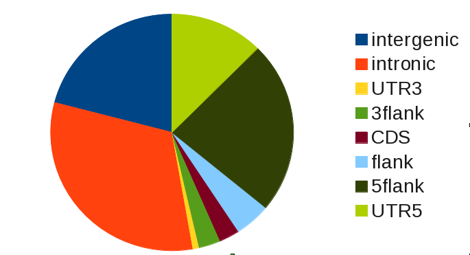
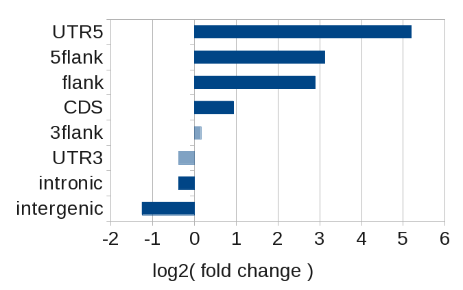

.. _tutorial2:

=============================
Tutorial - Genomic annotation
=============================

This tutorial demonstrates the usage of *gat* with
a simple example - where does a transcription factor bind in
the genome? 

As opposed to :ref:`tutorial1` we will not be looking at the overlap
between one set of intervals with another, but at the overlap of
one set of intervals with multiple others.

This tutorial uses the SRF data set described in `Valouev et
al. (2008)`_. The data sets used in this tutorial are available at:

http://www.cgat.org/~andreas/documentation/gat-examples/TutorialGenomicAnnotation.tar.gz

The data is in :file:`srf.hg19.bed.gz`. This :term:`bed` formatted file
contains 556 high confidence peaks from the analysis of `Valouev et al. (2008)`_
mapped to human chromosome hg19.

We build the analysis in multiple steps. First, we will perform a
simple analysis, which will also motivate the use of *gat*. Later,
we will build more sophisticated analyses that take into account
the effective genome.

First analysis
==============

*gat* requires three sets of intervals: 

1. a set of segments delineating the active part of the genome (:term:`workspace`), and
2. a set of segments of interest (:term:`tracks`), and
3. a set of segments with :term:`annotations`.

*gat* accepts :term:`bed` formatted files as input.

As segments of interest we will be using the :file:`srf.hgf19.bed.gz`
containing the results of the ChIP-Seq experiment::

   chr5    60627981        60628031        SRF.1
   chr5    137801055       137801105       SRF.2
   chr5    137800766       137800816       SRF.3
   chr7    5570273 5570323 SRF.4
   chr5    137827838       137827888       SRF.5
   ...

As our :term:`workspace` we will for now use the :term:`bed` formatted 
:file:`contigs.bed`, which simply lists all chromosomes in hg19::

   chr13   0       115169878       ws
   chr12   0       133851895       ws
   chr11   0       135006516       ws
   chr10   0       135534747       ws
   chr17   0       81195210        ws
   ...

As our annotations file, we will use the
:file:`annotations_geneset.bed.gz`.

This file required a little more effort to build. 
We took all protein genes of `Ensembl`_ (release
67) and merged the exons of all transcripts of a gene. Based on these
gene definitions we then divided genomic regions into intergenic,
intronic and exonic regions. We also annotated the UTR (5' and 3'), 
and the 5kb flank upstream and downstream. The result is a set of
non-overlapping intervals covering the full genome::

    ...
    chr1    362640  367639  5flank
    chr1    367640  367658  UTR5
    chr1    367659  368594  CDS
    chr1    368595  368634  UTR3
    chr1    368635  373634  3flank
    chr1    373635  616058  intergenic
    chr1    616059  621058  3flank
    chr1    621059  621098  UTR3
    chr1    621099  622034  CDS
    chr1    622035  622053  UTR5
    chr1    622054  627053  5flank
    ...

We can now run *gat* by giving specifying the three input files::

   gat-run.py --ignore-segment-tracks --segments=srf.hg19.bed.gz
      --annotations=annotations_geneset.bed.gz --workspace=contigs.bed.gz
   --num-samples=1000 --log=gat.log > gat.out

The option `--ignore-segment-tracks` tells *gat* to ignore the fourth
column in the :term:`tracks` file and assume that all intervals in
this file belong to the same :term:`track`. If not given, each
interval would be treated separately. 

The above statement finishes in a few seconds. With large interval
collections or many annotations, *gat* might take a while. It is thus
good practice to always save the output in a file. The option `--log`
tells gat to save information or warning messages into a separate log
file.

The first 11 columns of the output file are the most informative:

+-----------+---------------+-----------+----------+-------------+-------------+-----------+----------+----------+-------------+----------+
| track     | annotation    | observed  | expected | Ci95low     | CI95high    | stddev    | fold     | l2fold   | pvalue      | qvalue   |
+===========+===============+===========+==========+=============+=============+===========+==========+==========+=============+==========+
|merged     |intergenic     |5800       |14056.3300|13100.0000   |15000.0000   |583.7181   |0.4126    |-1.2771   |1.0000e-03   |1.5714e-03|
+-----------+---------------+-----------+----------+-------------+-------------+-----------+----------+----------+-------------+----------+
|merged     |intronic       |8816       |10633.8530|9665.0000    |11602.0000   |592.7589   |0.8291    |-0.2705   |1.0000e-03   |1.5714e-03|
+-----------+---------------+-----------+----------+-------------+-------------+-----------+----------+----------+-------------+----------+
|merged     |UTR3           |233        |278.0720  |100.0000     |493.0000     |117.3112   |0.8379    |-0.2551   |3.6500e-01   |4.4611e-01|
+-----------+---------------+-----------+----------+-------------+-------------+-----------+----------+----------+-------------+----------+
|merged     |3flank         |800        |659.6560  |400.0000     |1000.0000    |175.0544   |1.2128    |0.2783    |2.3100e-01   |3.1762e-01|
+-----------+---------------+-----------+----------+-------------+-------------+-----------+----------+----------+-------------+----------+
|merged     |CDS            |754        |360.7680  |161.0000     |580.0000     |127.2204   |2.0900    |1.0635    |1.0000e-03   |1.5714e-03|
+-----------+---------------+-----------+----------+-------------+-------------+-----------+----------+----------+-------------+----------+
|merged     |flank          |1334       |167.8620  |50.0000      |350.0000     |91.4581    |7.9470    |2.9904    |1.0000e-03   |1.5714e-03|
+-----------+---------------+-----------+----------+-------------+-------------+-----------+----------+----------+-------------+----------+
|merged     |5flank         |6524       |691.5400  |400.0000     |1000.0000    |185.0053   |9.4340    |3.2379    |1.0000e-03   |1.5714e-03|
+-----------+---------------+-----------+----------+-------------+-------------+-----------+----------+----------+-------------+----------+
|merged     |UTR5           |3441       |87.0110   |0.0000       |200.0000     |60.9119    |39.5467   |5.3055    |1.0000e-03   |1.5714e-03|
+-----------+---------------+-----------+----------+-------------+-------------+-----------+----------+----------+-------------+----------+

The first two columns contain the name of the :term:`track` and
:term:`annotation` that are being compared. The columns
:term:`observed` and :term:`expected` give the observed and expected
nucleotide overlap, respectively, between the :term:`track` and :term:`annotation`.

The following columns CI95low, CI95high, stddev give 95% confidence
intervals and the standard deviation of the sample distribution,
respectively.

The :term:`fold` column is the fold enrichment or depletion and is 
computed as the ratio of :term:`observed` over :term:`expected`. The
column :term:`l2fold` is the log2 of this ratio.

The column :term:`pvalue` gives the empirical :term:`p-value`, i.e. in what
proportion of samples was a higher enrichment or lower depletion
found than the one that was observed.

The column :term:`qvalue` lists a multiple testing corrected :term:`p-value`.
Setting a qvalue threshold and accepting only those comparisons with a
qvalue below that threshold corresponds to controlling the false discovery
rate at that particular level.

What does this table tell us? Looking at the column :term:`observed`
only, we see that most binding of SRF occurs in intronic and
intergenic regions: 

Strictly speaking, this is a a naive analysis that does not require
*gat*. The observed overlap alone does not tell us if the overlap we
see is more or less than
we expect. We do know that there are much more and larger intronic regions
than there are UTRs, for example.

More instructive is to look at the enrichment within the various
genomic regions, which is given by the :term:`fold` change.

Here, we clearly see that SRF binds preferentially at transcription 
start sites (UTR5 and 5flank), while its binding is actually less than
expected in introns and intergenic regions.

   Binding distribution of SRF with respect to known protein coding
   genes. Plotted is the log2(fold change). Value not significant
   are transparent.

The effective genome
=====================

In the previous analysis we used the complete genome (3.1Gb) as the
:term:`workspace`. However, that is not realistic. For example,
SRF will not be predicted in regions that are assembly gaps. 
Generally speaking, if the  workspace is too large, fold enrichment 
values will be too optimistic.

To get a more accurate estimate of the enrichment in various regions,
we should exclude assembly gaps. 

The :term:`bed` formatted file :file:`contigs_ungapped.bed.gz` contains
only those genomic regions that are not assembly gaps (2.86Gb). 
We can use this file instead::

   gat-run.py --ignore-segment-tracks --segments=srf.hg19.bed.gz
      --annotations=annotations_geneset.bed.gz --workspace=contigs_ungapped.bed.gz
      --num-samples=1000 --log=gat.log > gat.out

+----------+--------+----------+-------+-------+----------+----------+
|annotation|observed|expected  |fold   |l2fold |pvalue    |qvalue    |
+==========+========+==========+=======+=======+==========+==========+
|intergenic|5800    |13806.4540|0.4201 |-1.2512|1.0000e-03|2.2000e-03|
+----------+--------+----------+-------+-------+----------+----------+
|UTR3      |233     |303.6340  |0.7674 |-0.3820|2.5300e-01|3.9757e-01|
+----------+--------+----------+-------+-------+----------+----------+
|intronic  |8816    |11473.2200|0.7684 |-0.3801|1.0000e-03|2.2000e-03|
+----------+--------+----------+-------+-------+----------+----------+
|3flank    |800     |713.4290  |1.1213 |0.1652 |3.4000e-01|4.6750e-01|
+----------+--------+----------+-------+-------+----------+----------+
|CDS       |754     |391.1840  |1.9275 |0.9467 |5.0000e-03|9.1667e-03|
+----------+--------+----------+-------+-------+----------+----------+
|flank     |1334    |182.0200  |7.3289 |2.8736 |1.0000e-03|2.2000e-03|
+----------+--------+----------+-------+-------+----------+----------+
|5flank    |6524    |761.1600  |8.5711 |3.0995 |1.0000e-03|2.2000e-03|
+----------+--------+----------+-------+-------+----------+----------+
|UTR5      |3441    |97.3670   |35.3405|5.1433 |1.0000e-03|2.2000e-03|
+----------+--------+----------+-------+-------+----------+----------+

The associated fold changes change, albeit not much. But have we done
enough? The SRF intervals are the result of a ChIP-Seq
experiment. Because these were short reads (25bp), not all can be
unambiguously mapped to a unique genomic location. This again
effectively removes some genomic regions from the analysis.

The :term:`bed` formatted :file:`mapability_36.filtered.bed.gz`
contains all those genomic regions, that are uniquely mapable with
reads of 24 bases. These regions have been derived from the UCSC
mapability tracks and reduce the effective genome considerably
(1.96Gb).

We could intersect the two bed files ourselves, but we can also
supply multiple workspaces to *gat*. *gat* will automatically
intersect multiple workspaces::

   gat-run.py --ignore-segment-tracks --segments=srf.hg19.bed.gz
      --annotations=annotations_geneset.bed.gz
      --workspace=contigs_ungapped.bed.gz
      --workspace=mapability_36.filtered.bed.gz
      --num-samples=1000 --log=gat.log > gat.out

As a consequence of reducing the workspace the fold changes change:

+----------+--------+----------+-------+-------+----------+----------+
|annotation|observed|expected  |fold   |l2fold |pvalue    |qvalue    |
+==========+========+==========+=======+=======+==========+==========+
|intergenic|5800    |12531.2490|0.4628 |-1.1114|1.0000e-03|1.6000e-03|
+----------+--------+----------+-------+-------+----------+----------+
|UTR3      |233     |385.1620  |0.6049 |-0.7251|1.1000e-01|1.2571e-01|
+----------+--------+----------+-------+-------+----------+----------+
|intronic  |8816    |10942.7440|0.8056 |-0.3118|1.0000e-03|1.6000e-03|
+----------+--------+----------+-------+-------+----------+----------+
|3flank    |800     |625.3780  |1.2792 |0.3553 |1.6500e-01|1.6500e-01|
+----------+--------+----------+-------+-------+----------+----------+
|CDS       |754     |540.3700  |1.3953 |0.4806 |8.2000e-02|1.0933e-01|
+----------+--------+----------+-------+-------+----------+----------+
|flank     |1334    |166.6400  |8.0053 |3.0010 |1.0000e-03|1.6000e-03|
+----------+--------+----------+-------+-------+----------+----------+
|5flank    |6524    |638.2110  |10.2223|3.3537 |1.0000e-03|1.6000e-03|
+----------+--------+----------+-------+-------+----------+----------+
|UTR5      |3441    |122.2010  |28.1585|4.8155 |1.0000e-03|1.6000e-03|
+----------+--------+----------+-------+-------+----------+----------+

.. _Valouev et al. (2008): http://www.ncbi.nlm.nih.gov/pubmed/19160518
.. _GREAT: http://bejerano.stanford.edu/great/public/html/
.. _MacLean et al. (2010): http://www.ncbi.nlm.nih.gov/pubmed/20436461
.. _Ensembl: http:://www.ensembl.org
.. _GO Gene Ontology: http://www.geneontology.org/
