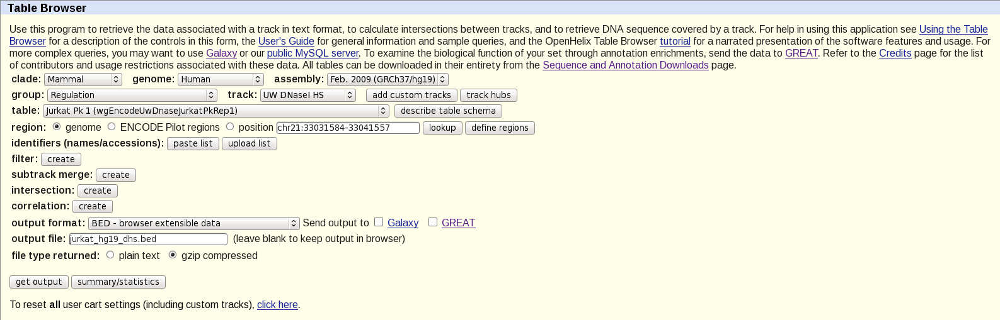

.. _tutorial1:

=============================
Tutorial - Interval overlap
=============================

This tutorial demonstrates the usage of *gat* with
a simple example - do the binding sites of a transcription factor 
overlap with DNAse hypersensitive sites?

This tutorial uses the SRF data set described in `Valouev et
al. (2008)`_. The data sets used in this tutorial are available at:

http://www.cgat.org/~andreas/documentation/gat-examples/TutorialIntervalOverlap.tar.gz

The data is in :file:`srf.hg19.bed`. This :term:`bed` formatted file
contains 556 high confidence peaks from the analysis of `Valouev et al. (2008)`_
mapped to human chromosome hg19.

This tutorial concentrates on obtaining the data required for a GAT
analysis.

First analysis
==============

*gat* requires three sets of intervals: 

1. a set of segments delineating the active part of the genome (:term:`workspace`), and
2. a set of segments of interest (:term:`tracks`), and
3. a set of segments with :term:`annotations`.

*gat* accepts :term:`bed` formatted files as input.

As segments of interest we will be using the :file:`srf.hgf19.bed`
containing the results of the ChIP-Seq experiment::

   chr5    60627981        60628031        SRF.1
   chr5    137801055       137801105       SRF.2
   chr5    137800766       137800816       SRF.3
   chr7    5570273 5570323 SRF.4
   chr5    137827838       137827888       SRF.5
   ...

As our :term:`workspace` we will for now use the :term:`bed` formatted 
:file:`contigs.bed`, which simply lists all chromosomes in hg19::

   chr13   0       115169878       ws
   chr12   0       133851895       ws
   chr11   0       135006516       ws
   chr10   0       135534747       ws
   chr17   0       81195210        ws
   ...

The question we ask is whether within the genome, SRF binding events
are in regions of open chromatin as identified by DNAse I
hypersensitive sites. 

There are many sources for :term:`bed` files. Not having the data 
ourselves, we make use of data deposited by the ENCODE_ project within 
the UCSC_ genome browser.

To find the relevant data, we start by searching for the term
``Jurkat`` with ``track search``. We find the page with a list of ENCODE_ datasets:

http://genome.ucsc.edu/cgi-bin/hgTrackUi?g=wgEncodeUwDnase&hgsid=337398699

Selecting ``Jurkat``, we can then open the  ``table browser`` and
download :term:`bed` formatted coordinates directly:

Alternative ways to obtain and manipulate bed-files are galaxy_ and
bedtools_.

.. _galaxy: https://main.g2.bx.psu.edu/
.. _bedtools: http://code.google.com/p/bedtools/

We can now run *gat* by giving specifying the three input files::

   gat-run.py 
      --segments=srf.hg19.bed.gz
      --annotations=jurkat.hg19.dhs.bed.gz 
      --workspace=contigs.bed.gz
      --ignore-segment-tracks 
      --num-samples=1000 --log=gat.log > gat.tsv

The option `--ignore-segment-tracks` tells *gat* to ignore the fourth
column in the :term:`tracks` file and assume that all intervals in
this file belong to the same :term:`track`. If not given, each
interval would be treated separately. 

The above statement finishes in a few seconds. With large interval
collections or many annotations, *gat* might take a while. It is thus
good practice to always save the output in a file. The option `--log`
tells gat to save information or warning messages into a separate log
file.

The first 10 columns of the output file are the most informative:

+------+------------------------------+--------+--------+-------+--------+--------+-------+------+----------+
|track |annotation                    |observed|expected|CI95low|CI95high|stddev  |fold   |l2fold|pvalue    |
+------+------------------------------+--------+--------+-------+--------+--------+-------+------+----------+
|merged|tb_wgEncodeUwDnaseJurkatPkRep1|20183   |246.5650|96.0000|444.0000|105.5933|81.5301|6.3493|1.0000e-03|
+------+------------------------------+--------+--------+-------+--------+--------+-------+------+----------+

The table states that we observe an overlap of 20,183 nucleotides,
but would expect an overlap of 247 nucleotides, which is an 82 fold 
enrichment. This is highly significant (p-value of 0.001). 

Note that the number of simulations determines the minimum P-value
that can be reported. Here, we did 1,000 simulations, thus the minimum
P-value we can obtain is 0.001. Usually a few simulations (100) are
required to get a good idea about enrichment. For publication,
more simulations are required (>10,000) to get a good idea of the
statistical significance.

More samples increases memory and runtime requirements of GAT. The computation
above took 11 seconds on our local system. Increasing the number
of simulations to 10.000 increases the runtime to 103 seconds. 
Note how the runtime increases linearly with the number of samples.

.. _Valouev et al. (2008): http://www.ncbi.nlm.nih.gov/pubmed/19160518
.. _UCSC: http://genome.ucsc.edu/
.. _ENCODE: http://genome.ucsc.edu/ENCODE/

Do the results make sense? Instead of the Jurkat cells, we can test
for enrichment with DHS sites in hepatocytes. 

We obtain a :term:`bed`-file as before from UCSC_ and ENCODE_ (cell line
``hepg2``) and save it as :file:`hepg2.hg19.dhs.bed.gz`. Next, we run GAT
with this file instead::

     gat-run.py --segments=srf.hg19.bed.gz 
     		--annotations=hepg2.hg19.dhs.bed.gz 
		--workspace=contigs.bed.gz
		--ignore-segment-tracks 
                --num-samples=1000 
		--log=gat-hepg-unique.tsv.log

GAT reports:

+------+-----------------------------------+--------+--------+--------+--------+--------+-------+------+----------+
|track |annotation                         |observed|expected|CI95low |CI95high|stddev  |fold   |l2fold|pvalue    |
+------+-----------------------------------+--------+--------+--------+--------+--------+-------+------+----------+
|merged|tb_wgEncodeUwDnaseHepg2HotspotsRep1|18965   |597.1380|339.0000|883.0000|166.9945|31.7084|4.9868|1.0000e-03|
+------+-----------------------------------+--------+--------+--------+--------+--------+-------+------+----------+

Note how the fold enrichment is now less (32 fold), though still highly significant.
This is the expected result, DHS sensitive sites are shared among different tissue
types.

We can test this by comparing the two different DHS sets against each other::

    gat-run.py --segments=hepg2.hg19.dhs.bed.gz 
               --annotations=jurkat.hg19.dhs.bed.gz 
	       --workspace=contigs.bed.gz --ignore-segment-tracks --num-samples=1000 > dhs.tsv

+------+------------------------------+--------+-----------+-----------+-----------+---------+-------+------+----------+----------+
|track |annotation                    |observed|expected   |CI95low    |CI95high   |stddev   |fold   |l2fold|pvalue    |qvalue    |
+------+------------------------------+--------+-----------+-----------+-----------+---------+-------+------+----------+----------+
|merged|tb_wgEncodeUwDnaseJurkatPkRep1|6163503 |456928.2770|443565.0000|470129.0000|8119.7800|13.4890|3.7537|1.0000e-03|1.0000e-03|
+------+------------------------------+--------+-----------+-----------+-----------+---------+-------+------+----------+----------+

Indeed, the overlap between DHS sites is significant (pvalue = 0.001). We observe
a 6.2Mb overlap, but expect only a 0.5Mb overlap. This is a 13-fold enrichment.

The runtime has increased from 11s to 308s. Apart from the number of samples, the number of segments
in the :term:`segments of interest` are a major determinant of the time it takes to complete a
run. More information about memory and time requirement of GAT are in the section about GAT 
:ref:`performance`.

Let us try removing all intervals from ``hepg2.hg19.dhs.bed.gz`` that overlap sites found in 
Jurkat cells using bedtools_::

   intersectBed -a hepg2.hg19.dhs.bed.gz -b jurkat.hg19.dhs.bed.gz -wa -v | gzip  > hepg2_unique.dhs.bed.gz

106,308 segments out of 144,172 remain.

Next, we re-run the GAT analysis::

    gat-run.py --segments=srf.hg19.bed.gz --annotations=hepg2-unique.hg19.dhs.bed.gz --workspace=contigs.bed.gz  \
               --ignore-segment-tracks      \
                --num-samples=1000 --log=gat-hepg-unique.tsv.log

+------+----------+--------+--------+--------+--------+--------+------+------+----------+----------+
|track |annotation|observed|expected|CI95low |CI95high|stddev  |fold  |l2fold|pvalue    |qvalue    |
+------+----------+--------+--------+--------+--------+--------+------+------+----------+----------+
|merged|.         |425     |324.6790|143.0000|539.0000|117.8233|1.3080|0.3874|1.8500e-01|1.8500e-01|
+------+----------+--------+--------+--------+--------+--------+------+------+----------+----------+

Now, we observe only a 30% enrichment and this is not significant (P-value 0.19). 
The observed overlap of 425 nucleotides is very close to the expected 325 nucleotides. We conclude,
that the overlap of SRF between DHS sites in hepatocytes is due to those DHS sites that are shared
between hepatocytes and Jurkat cells.

This example showed how GAT can be used in a very simple scenario to test if two genomic features
are associated with each other. The following tutorials will introduce more complex usage, for example 
using the effective genome and testing multiple annotations simultaneously.

		

